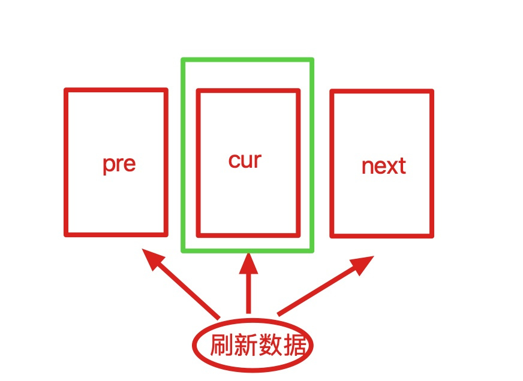

# YCBannerView

[](https://cocoapods.org/pods/YCBannerView)
[](https://cocoapods.org/pods/YCBannerView)
[](https://cocoapods.org/pods/YCBannerView)


## 简介

`效果图如下`


<font color=#FF0000 >喜欢的朋友希望给个Star支持一下,谢谢!!!</font>

`欢迎预览` [实现方案博客地址](https://juejin.cn/post/7039356899229171742 "") 


---
## 描述

1、`YCBannerView` 一款轻量级的滚动轮播框架，支持自定义滚动视图。内部依赖了`Masonry`三方库，支持`Masonry`、`Frame`布局方式。

2、采用<font color=#0000FF >UITableView</font> 的设计思想,内部使用三张视图实现视图的复用，通过代理方法回调对应的刷新方法，具体参考demo



3、提供了以下功能
    - 轮播图点击事件
    - 轮播图自动滚动和手动滚动
    - 轮播图滚动的比例、方向回调，方便上层实现具体的业务
    - 刷新对应的cell 
    - 当前正在显示的cell索引回调
    
4、示例Demo演示的功能
    - 普通的轮播图演示
    - 轮播图滚动更改父视图的背景颜色 


## 相关用法

```objc

#pragma mark - 代理方法

#pragma mark - YCBannerViewDelegate

/**
 轮播图更新Cell
 @param bannerView 轮播图
 @param bannerCell 轮播图Cell
 @param index Cell对应的索引
 */
- (void)yc_bannerView:(YCBannerView *)bannerView updateDisplayCell:(YCBannerCell *)bannerCell cellForIndex:(NSUInteger)index {
    if (index >= self.mArrayData.count) {
        return;
    }
    [bannerCell setObject:self.mArrayData[index]];
}

/**
 轮播图点击事件
 @param bannerView 轮播图
 @param index 点击Cell对应的索引
 */
- (void)yc_bannerView:(YCBannerView *)bannerView didSelectedIndex:(NSUInteger)index {
    NSLog(@"Ryc_____ 点击了第%@个",@(index));
}

#pragma mark - YCBannerViewDataSource

/**
 *  一共有多少个cell
 */
- (NSInteger)yc_numberOfRowsInBannerView:(YCBannerView *)bannerView {
    return self.mArrayData.count;
}

/**
 对应的Cell样式
 @param bannerView 轮播图
 */
- (YCBannerCell *)yc_createCellInBannerView:(YCBannerView *)bannerView {
    YCBannerCell *cell = [[YCBannerCell alloc] init];
    cell.backgroundColor = [self p_randomColor];
    return cell;
}

```

## Installation

YCBannerView is available through [CocoaPods](https://cocoapods.org). To install
it, simply add the following line to your Podfile:

```ruby
pod 'YCBannerView'
```

## Author

Rycccccccc, 787725121@qq.com

## License

YCBannerView is available under the MIT license. See the LICENSE file for more info.
